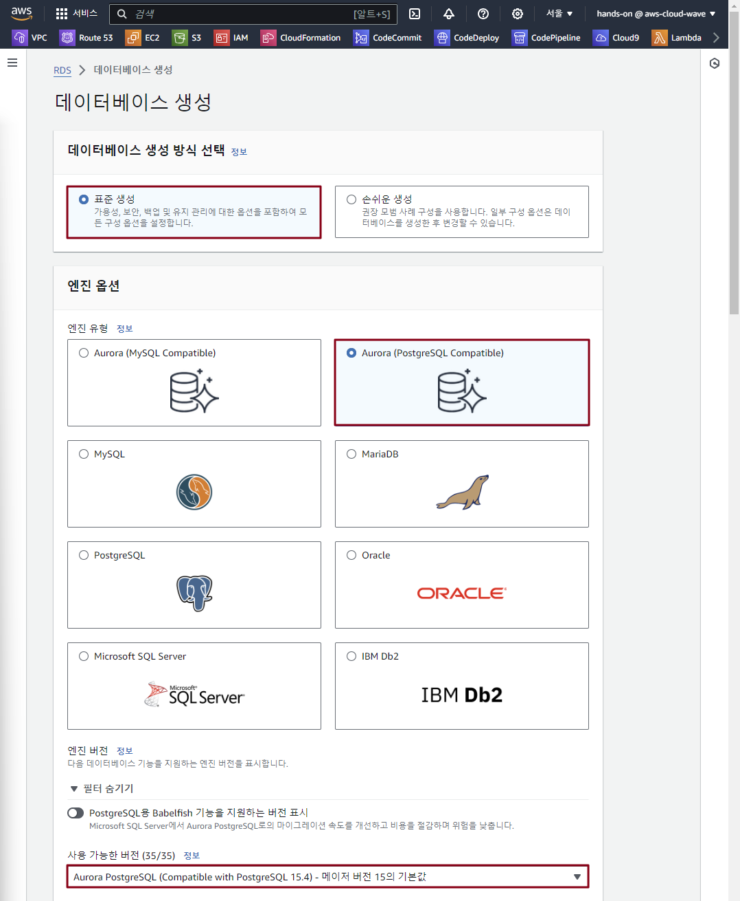
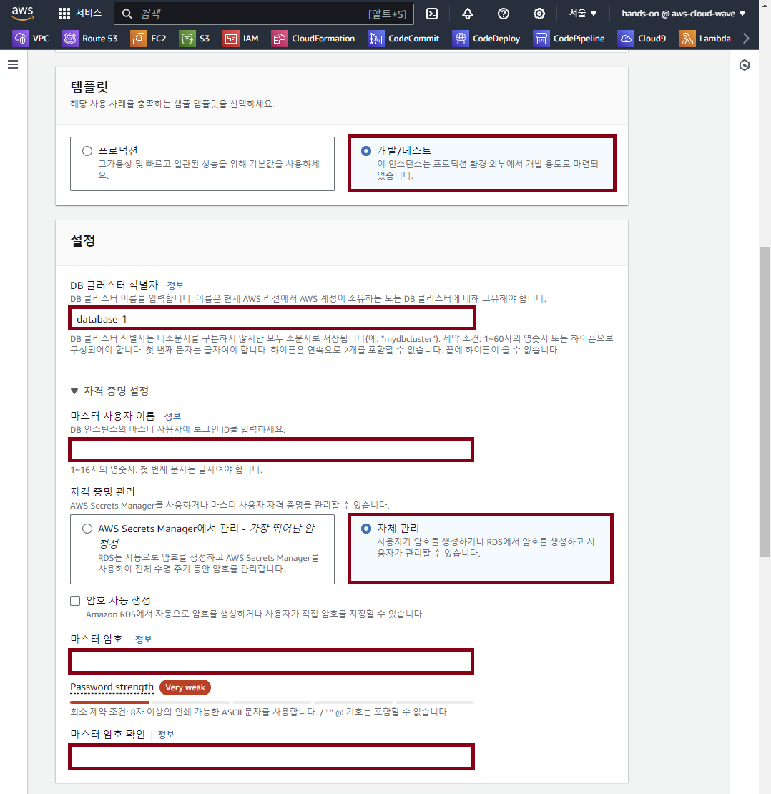
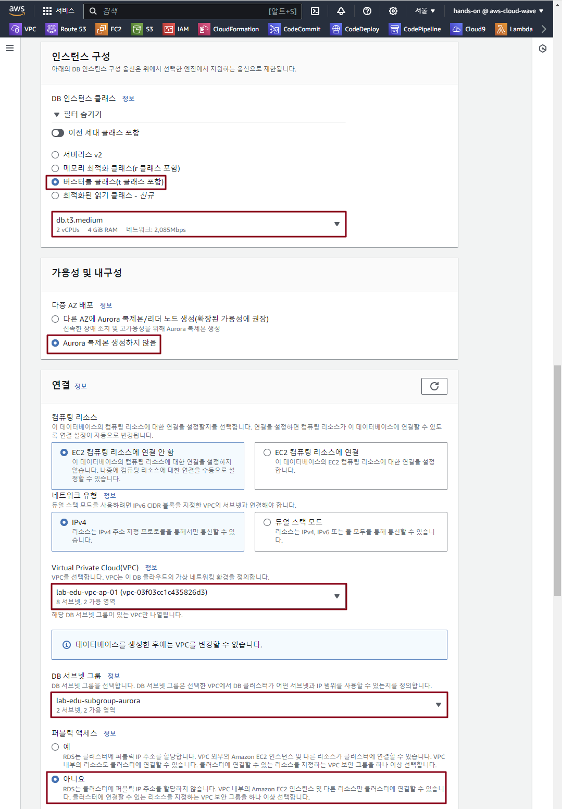
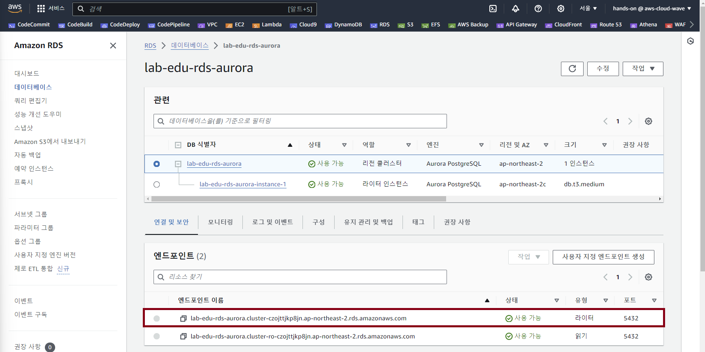

## Aurora Database 생성

### 1. Database Network Basline 생성

#### 1.1 Database Subnet 생성

- **VPC 메인 콘솔 화면 → `Subnet` 리소스 탭 → `Subnet 생성` 버튼 클릭**

- 아래 서브넷 자원 명세서를 참고하여 생성 정보 입력

- 화면 하단의 `서브넷 추가` 버튼 이용 여러 개의 서브넷 정보 동시 입력 가능 

    |                   | Database Subnet 01 | Database Subnet 02 |
    | :---------------: | :----------------: | :----------------: |
    |      VPC_ID       | leb-edu-vpc-ap-01  | leb-edu-vpc-ap-01  |
    |    Subnet_Name    | lab-edu-sub-db-01  | lab-edu-sub-db-02  |
    | Availability_Zone |  ap-northeast-2a   |  ap-northeast-2c   |
    |     IPv4 CIDR     |    10.0.80.0/24    |    10.0.81.0/24    |

#### 1.2 Database Routing Table 생성

- 아래 라우팅 테이블 명세서를 참고하여 생성 정보 입력

    |        |        Database Routing Table        |
    | :----: | :----------------------------------: |
    |  Name  |            lab-edu-rtb-db            |
    |  VPC   |          lab-edu-vpc-ap-01           |
    | Subnet | lab-edu-sub-db-01, lab-edu-sub-db-02 |


### 2. Security Group 생성

- **EC2 메인 콘솔 화면 → `보안 그룹` 탭 → `보안그룹 생성` 버튼 클릭**

- 아래 **보안그룹 자원 명세서** 정보 참고하여 설정

    |     Region     |     VPC_Name      |       Name        |   Rule   | port  | Protocol |   Source    |
    | :------------: | :---------------: | :---------------: | :------: | :---: | :------: | :---------: |
    | ap-northeast-2 | lab-edu-vpc-ap-01 | lab-edu-sg-aurora | In-bound | 5432  | Postgres | 10.0.0.0/16 |

### 3. Subnet Group 생성

- **RDS 메인 콘솔 화면 → `서브넷 그룹` 탭 → `DB 서브넷 그룹 생성` 버튼 클릭**

    

- DB 서브넷 그룹 생성 정보 입력

    - 이름: lab-edu-subgroup-aurora

    - VPC: lab-edu-vpc-ap-01

    - 가용영역: 

        - ap-northeast-2a

        - ap-northeast-2c

    - 서브넷: 

        - lab-edu-sub-db-01

        - lab-edu-sub-db-02

    - `생성` 버튼 클릭

        

### 4. Aurora 생성

- **RDS 메인 콘솔 화면 → `데이터 베이스` 리소스 탭 → `데이터 베이스 생성` 버튼 클릭**

- 데이터 베이스 생성 정보 입력

    - 엔진 유형: Aurora (PostgreSQL Compatible)

    - 사용 가능한 버전: Aurora PostgreSQL 15.4

        

    - 템플릿: 개발/테스트

    - DB 클러스터 식별자: lab-edu-rds-aurora

    - 마스터 사용자 이름: postgres

    - `자체 관리` 항목 선택

    - 마스터 암호: qwer1234

    - 마스터 암호 확인: qwer1234

        

    - 인스턴스 구성: `버스터블 클래스(t 클래스 포함)` → `db.t3.medium`

    - 다중 AZ 배포: Aurora 복제본 생성하지 않음

    - VPC: lab-edu-vpc-ap-01

    - DB 서브넷 그룹: lab-edu-subgroup-aurora

    - 퍼블릭 액세스: 아니오

        

    - 보안그룹: lab-edu-sg-aurora

    - 성능 개선 도우미: `Performance Insights 활성화` 체크 해제

    - 모니터링: `Enhanced 모니터링 활성화` 체크 해제

    - `데이터 베이스 생성` 버튼 클릭

<br>


## Aurora PostgreSQL 접속

### 1. PostgreSQL 접속 Tool 설치

- VS Code IDE Terminal 접속 → PostgreSQL 접속 Tool 다운로드 스크립트 실행

    ```bash
    cd /Workspace/scripts/
    sh install_postgresql_in_ubuntu24.04_lts.sh
    ```

### 2. PostgreSQL 접속

- Aurora 접속 정보 확인

    - **RDS 메인 콘솔 화면 → `데이터베이스` 탭 → `lab-edu-rds-aurora` 데이터 베이스 클릭**

    - 엔드포인트 탭의 엔드포인트 이름 복사 (별도 메모장에 저장)

        

- PostgreSQL 접속

    ```bash
    # Connect aurora
    psql -U postgres -h {RDS_AURORA_ENDPOINT}           # 앞에서 메모장에 저장한 RDS Aurora 엔드포인 정보 입력
    Password for user postgres: {RDS_AURORA_PASSWORD}   # 생성과정에 입력했던 패스워드 입력

    psql (15.6, server 15.4)
    SSL connection (protocol: TLSv1.3, cipher: TLS_AES_256_GCM_SHA384, compression: off)
    Type "help" for help.

    postgres=>
    ```

### 3. PostgreSQL Database, User 생성 및 권한 할당

- Cloud9 IDE 접속 → SQL Query Sample 파일 열기 (support_files/sql_query/initial_settings_db.sql) → 내용 복사 → 붙여넣기

    ```sql
    create database trip_advisor;
    create user "user" with password 'qwer1234';
    grant all privileges on database trip_advisor to "user";
    alter database trip_advisor owner to "user";
    ```

- `user` 계정 활용 `trip_advisor` 접속 테스트

    ```bash
    psql –U user –d trip_advisor –h {RDS_AURORA_ENDPOINT}   # 앞에서 메모장에 저장한 RDS Aurora 엔드포인 정보 입력
    Password for user user: {RDS_AURORA_PASSWORD}       # 생성과정에 입력했던 패스워드 입력
    ```


